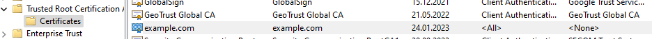
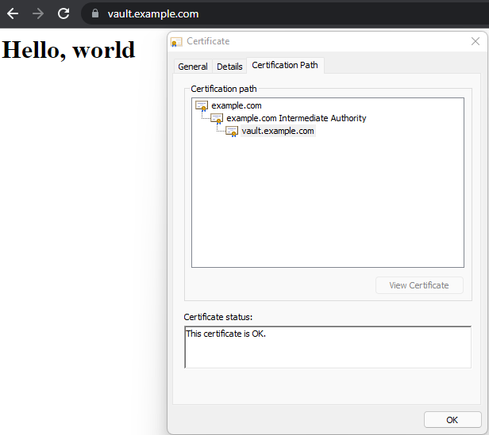
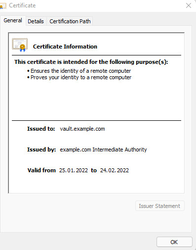
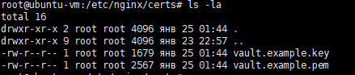
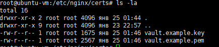
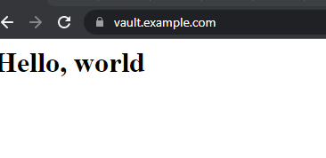

# Курсовая работа по итогам модуля "DevOps и системное администрирование"  

### 1. Процесс установки и настройки ufw
установка ufw
```shell
root@ubuntu-vm:/home/anton# apt-get install ufw
```
процесс настройки:  

- добавляем правила для 23 и 443 порта:
```shell
root@ubuntu-vm:/home/anton# ufw status verbose numbered
Status: inactive
root@ubuntu-vm:/home/anton# ufw allow 22
Rules updated
Rules updated (v6)
root@ubuntu-vm:/home/anton# ufw allow 443
Rules updated
Rules updated (v6)
root@ubuntu-vm:/home/anton# ufw allow in on lo from any
Rules updated
Rules updated (v6)
```
- добавляем правило для интерфейса lo
```shell
root@vagrant:/home/vagrant# ufw allow in on lo from any
```  
Итоговые настройки:
```shell
root@ubuntu-vm:/home/anton# ufw status verbose numbered
Status: active
Logging: on (low)
Default: deny (incoming), allow (outgoing), disabled (routed)
New profiles: skip

To                         Action      From
--                         ------      ----
80,443/tcp (Apache Full)   ALLOW IN    Anywhere                  
22                         ALLOW IN    Anywhere                  
443                        ALLOW IN    Anywhere                  
Anywhere on lo             ALLOW IN    Anywhere                  
80,443/tcp (Apache Full (v6)) ALLOW IN    Anywhere (v6)             
22 (v6)                    ALLOW IN    Anywhere (v6)             
443 (v6)                   ALLOW IN    Anywhere (v6)             
Anywhere (v6) on lo        ALLOW IN    Anywhere (v6)  
```

### 2. Процесс установки и выпуска сертификата vault  

```shell
root@ubuntu-vm:/home/anton# curl -fsSL https://apt.releases.hashicorp.com/gpg | sudo apt-key add -
OK
```
```shell
root@ubuntu-vm:/home/anton# sudo apt-add-repository "deb [arch=amd64] https://apt.releases.hashicorp.com $(lsb_release -cs) main"

```

```shell
root@ubuntu-vm:/home/anton# sudo apt-get update && sudo apt-get install vault
```

```
sudo apt-get install jq
```

Далее создал unit запуска vault
далее
```
systemctl daemon-reload
systemctl enable vault
systemctl start vault
```
далее
```
export VAULT_ADDR='http://127.0.0.1:8200'
```
далее для распечатывания я создал 3 ключа из веб-интерфеса, 
но можно это сделать и командой
```
vault operator init -n 3 -t 2 | sudo tee /etc/vault.d/init.file
```
Далее нужно предоставить 2 ключа для распечатывания vault.  
После распечатывания можно приступать к созданию сертификатов.  
Вначале создадим корневой сертификат центра сертификации:
```bash
 
root@ubuntu-vm:/home/anton# vault secrets enable pki
Success! Enabled the pki secrets engine at: pki/
root@ubuntu-vm:/home/anton# vault secrets tune -max-lease-ttl=87600h pki
Success! Tuned the secrets engine at: pki/
root@ubuntu-vm:/home/anton# vault write -format=json pki/root/generate/internal common_name="example.com" ttl=8760h > pki-ca-root.json
root@ubuntu-vm:/home/anton# cat pki-ca-root.json | jq -r .data.certificate > ca.pem
root@ubuntu-vm:/home/anton# vault write pki/config/urls issuing_certificates="$VAULT_ADDR/v1/pki/ca" crl_distribution_points="$VAULT_ADDR/v1/pki/crl"
Success! Data written to: pki/config/urls    
```

устанвливаем корневой сертификат на хостовую машину через mmc
ca.pem


Генерируем промежуточный сертификат:
```bash
root@ubuntu-vm:/home/anton# vault secrets enable -path=pki_int pki
Success! Enabled the pki secrets engine at: pki_int/
root@ubuntu-vm:/home/anton# vault secrets tune -max-lease-ttl=43800h pki_int
Success! Tuned the secrets engine at: pki_int/
root@ubuntu-vm:/home/anton# vault write -format=json pki_int/intermediate/generate/internal common_name="example.com Intermediate Authority" | jq -r '.data.csr' > pki.intermediate.csr
root@ubuntu-vm:/home/anton# vault write -format=json pki/root/sign-intermediate csr=@pki.intermediate.csr format=pem_bundle ttl="43800h" | jq -r '.data.certificate' > intermediate.cert.pem
root@ubuntu-vm:/home/anton# vault write pki_int/intermediate/set-signed certificate=@intermediate.cert.pem
Success! Data written to: pki_int/intermediate/set-signed

```

Создаем роль для генерации сертификатов
```bash
root@ubuntu-vm:/home/anton# vault write pki_int/roles/example-dot-com allowes_domains="example.com" allow_subdomains=true max_ttl="720h"
Success! Data written to: pki_int/roles/example-dot-com
```
создали политику
```
root@ubuntu-vm:/home/anton# vault policy write pki_int pki_int.hcl
```

создали пользователя
```
root@ubuntu-vm:/home/anton# vault auth enable userpass
Success! Enabled userpass auth method at: userpass/
root@ubuntu-vm:/home/anton# vault write auth/userpass/users/anton password="secret" token_policy="pki_int"
Success! Data written to: auth/userpass/users/anton

```

можно не создавать пользователя, а просто получить токен
```
(vault token create -format=json -policy="pki_int" | jq -r ".auth.client_token")>user.token
```
далее этот файл можно использовать в скрипте

выпускаем сертификат для сайта
```
export VAULT_ADDR=http://127.0.0.1:8200
export VAULT_TOKEN=`cat /home/anton/user.token`

vault write -format=json pki_int/issue/example-dot-com \
        common_name=vault.example.com > /home/anton/vault.example.com.crt
cat /home/anton/vault.example.com.crt | jq -r .data.certificate > /home/anton/web-server/certs/vault.example.pem
cat /home/anton/vault.example.com.crt | jq -r .data.issuing_ca >> /home/anton/web-server/certs/vault.example.pem
cat /home/anton/vault.example.com.crt | jq -r .data.private_key > /home/anton/web-server/certs/vault.example.key
```

###3. Процесс установки и настройки сервера nginx
```
sudo apt-add-repository ppa:nginx/stable
sudo apt update
sudo apt install nginx
sudo systemctl enable nginx
```

далее прописал в настройках сайта SSL, и пути к сертификатам
```
root@ubuntu-vm:/etc/nginx/sites-available# vim default

# available underneath a path with that package name, such as /drupal8.
#
# Please see /usr/share/doc/nginx-doc/examples/ for more detailed examples.
##

# Default server configuration
#
server {
        #listen 80 default_server;
        #listen [::]:80 default_server;

        # SSL configuration
        #
         listen 443 ssl default_server;
        # listen [::]:443 ssl default_server;
         server_name vault.example.com;
         ssl_certificate  /etc/nginx/certs/vault.example.pem;
         ssl_certificate_key  /etc/nginx/certs/vault.example.key;
         ssl_protocols TLSv1 TLSv1.1 TLSv1.2;
         ssl_ciphers  HIGH:!aNULL:!MD5;
        #
        # Note: You should disable gzip for SSL traffic.
        # See: https://bugs.debian.org/773332
        #
        # Read up on ssl_ciphers to ensure a secure configuration.
        # See: https://bugs.debian.org/765782
        #
        # Self signed certs generated by the ssl-cert package
        # Don't use them in a production server!
        #
        # include snippets/snakeoil.conf;

        root /var/www/html;

```

скопировал сертификаты в папку `etc/nginx/certs/`  
Страница сервера nginx в браузере хоста не содержит предупреждений

  


срок действия:
  


###4. Создайте скрипт, который будет генерировать новый сертификат в vault:  
```
#!/bin/bash
export VAULT_ADDR=http://127.0.0.1:8200
export VAULT_TOKEN=`cat /home/anton/user.token`

vault write -format=json pki_int/issue/example-dot-com \
        common_name=vault.example.com > /home/anton/vault.example.com.crt
cat /home/anton/vault.example.com.crt | jq -r .data.certificate > /home/anton/web-server/certs/vault.example.pem
cat /home/anton/vault.example.com.crt | jq -r .data.issuing_ca >> /home/anton/web-server/certs/vault.example.pem
cat /home/anton/vault.example.com.crt | jq -r .data.private_key > /home/anton/web-server/certs/vault.example.key
cp /home/anton/web-server/certs/vault.example.pem /etc/nginx/certs/
cp /home/anton/web-server/certs/vault.example.key /etc/nginx/certs/
`nginx -s reload`

```

###5. Поместите скрипт в crontab, чтобы сертификат обновлялся какого-то числа каждого месяца в удобное для вас время.  
отредактировал crontab на запуск каждые 2 минуты
```
root@ubuntu-vm:/home/anton# vim /etc/crontab 

# /etc/crontab: system-wide crontab
# Unlike any other crontab you don't have to run the `crontab'
# command to install the new version when you edit this file
# and files in /etc/cron.d. These files also have username fields,
# that none of the other crontabs do.

SHELL=/bin/sh
PATH=/usr/local/sbin:/usr/local/bin:/sbin:/bin:/usr/sbin:/usr/bin

# Example of job definition:
# .---------------- minute (0 - 59)
# |  .------------- hour (0 - 23)
# |  |  .---------- day of month (1 - 31)
# |  |  |  .------- month (1 - 12) OR jan,feb,mar,apr ...
# |  |  |  |  .---- day of week (0 - 6) (Sunday=0 or 7) OR sun,mon,tue,wed,thu,fri,sat
# |  |  |  |  |
# *  *  *  *  * user-name command to be executed
17 *    * * *   root    cd / && run-parts --report /etc/cron.hourly
25 6    * * *   root    test -x /usr/sbin/anacron || ( cd / && run-parts --report /etc/cron.daily )
47 6    * * 7   root    test -x /usr/sbin/anacron || ( cd / && run-parts --report /etc/cron.weekly )
52 6    1 * *   root    test -x /usr/sbin/anacron || ( cd / && run-parts --report /etc/cron.monthly )
*/2 * *  *  *   root /bin/bash /home/anton/generate_certificate.sh

```
было


стало



сайт работает, ошибок с сертификатом нет



